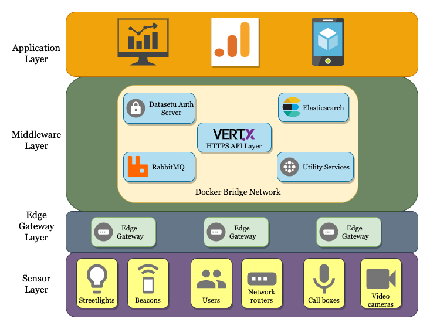

.. raw:: html

  

|github-workflow| |codacy| |coverage| |license| |dependabot| |docker-build-status| |docker-build-automation| |gitter|

.. |github-workflow|  image:: https://github.com/rbccps-iisc/vermillion/workflows/CI/badge.svg
   :target: https://github.com/rbccps-iisc/vermillion/actions         
.. |license| image:: https://img.shields.io/badge/license-ISC-orange
   :target: https://github.com/rbccps-iisc/vermillion/blob/master/LICENSE
.. |codacy| image:: https://api.codacy.com/project/badge/Grade/ab0fe028560a4f96a0b764dd842efa82
   :alt: Codacy Badge
   :target: https://app.codacy.com/gh/datasetu/vermillion?utm_source=github.com&utm_medium=referral&utm_content=datasetu/vermillion&utm_campaign=Badge_Grade
.. |coverage| image:: https://app.codacy.com/project/badge/Coverage/2eabe4553ff84ff0ab3e8cfca6734125
    :target: https://www.codacy.com/gh/datasetu/vermillion/dashboard?utm_source=github.com&amp;utm_medium=referral&amp;utm_content=datasetu/vermillion&amp;utm_campaign=Badge_Coverage
.. |dependabot| image:: https://img.shields.io/badge/dependabot-enabled-yellow
   :target: https://dependabot.com/
.. |docker-build-status| image:: https://img.shields.io/docker/cloud/build/iudx/java
   :target: https://hub.docker.com/repository/docker/iudx/java/builds
.. |docker-build-automation| image:: https://img.shields.io/docker/cloud/automated/iudx/java
   :target: https://hub.docker.com/repository/docker/iudx/java/builds
.. |gitter| image:: https://badges.gitter.im/vermillion-chat/community.svg
   :target: https://gitter.im/vermillion-chat/community?utm_source=badge&utm_medium=badge&utm_campaign=pr-badge   
    
Vermillion is a high performance, scalable and secure IoT middleware platform developed using `Vertx <https://vertx.io>`_. It is a middleware stack which focuses primarily on the compute layer in a smart city IoT deployment. One of the chief goals of Vermillion is to enable seamless data exchange between data producers and consumers in a smart city.

Architecture
============

The HTTPS APIs are written using `vertx <https://vertx.io>`_. The datastore used is `elasticsearch <https://elastic.co>`_, and the authentication and authorisation mechanism is using the `datasetu auth server <http://auth.datasetu.org>`_. A detailed architecture diagram for developers is in the works.

Performance
===========

Performance has been *the* key consideration while developing Vermillion. Initial results show that the middleware was able to handle at least ``130,000`` HTTPS requests/sec across ``18`` compute nodes. Computing Vermillion's performance under various conditions is still ongoing. 

A detailed white paper on this project published in Arxiv can be found `here <https://arxiv.org/abs/2003.08361>`_. The code for this setup and tests can be found in release 0.2.0. The following is a graph depicting results from the 18-node test:

.. image:: images/12-nodes.png
   :align: center

Quickstart
==========

#. Install the following dependencies:
  
     - docker
     - docker-compose
     - maven
  
   To run tests
  
     - python3
     - behave

#. Package the API server into a fat jar:

   .. code-block:: shell
   
    cd vermillion/api-server
    mvn clean package

#. Similarly package the authenticator

   .. code-block:: shell
    
    cd authenticator
    mvn clean package
  
#. Once the jar files are ready

   .. code-block:: shell
   
    cd setup
    ./install
     
#. To run tests

   .. code-block:: shell
    
    cd tests
    behave

Work on API documentation, developer docs and a stable release is ongoing

